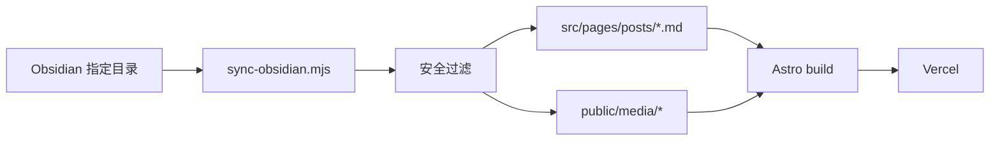

# 方案设计：Obsidian 到付费型个人知识博客

## 架构

## 同步模式

- `npm run sync:safe`：只同步 `publish: true`。
- `npm run sync -- --file <path>`：同步单篇库内文件。
- `npm run sync:publish-roots`：同步配置中的三个公开目录。

`sync:publish-roots` 是本次上线使用的模式。它不会写回源库，只生成站点副本。

## 安全过滤

过滤层分三类：

- 路径过滤：密钥、私钥、token、模板、`.env` 等命中文件名或路径直接跳过。
- 内容过滤：真实密钥格式、数据库密码配置、GitHub Secrets 私钥引用等模式直接跳过。
- 质量过滤：纯空文或极短文件跳过。

同步 manifest 会记录：

- `sourceFiles`
- `published`
- `skipped`
- `skippedReasons`
- `uploadedImages`

## UI 升级

首页结构：

- 首屏价值主张：把学习笔记变成可复用成长系统。
- 公开资产统计：文章数、主题数、图片资产数。
- 学习驾驶舱：展示路线、内容规模、转化路径。
- 付费服务卡：AI 编程陪跑、项目复盘诊断、Obsidian 知识库搭建。
- 三态内容：文稿、手记、思考。
- 精选合集：成功日记、计算机编程、恒洋听课笔记。
- 知识地图和同步状态。

文章页保持安静阅读，不加入强营销卡，避免损害信任。

## 部署策略

- 本地运行 `npm run sync:publish-roots` 生成公开内容。
- 提交 `src/pages/posts/`、`src/data/`、`public/media/`。
- Vercel 只运行 `npm run build`。
- 生产 URL：`https://ury-blog.vercel.app`。

## 后续增强

- 增加真实联系方式或支付表单。
- 按内容质量挑选首页 featured，而不是只按时间排序。
- 为长文增加目录和相关文章。
- 使用远程图床替代本地媒体提交，降低仓库体积。
